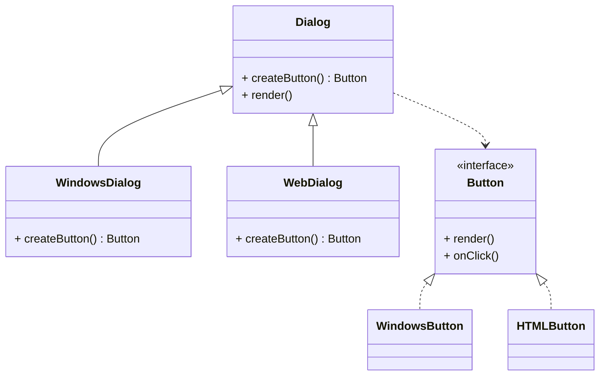

## 의도
팩토리 메서드는 부모 클래스에서 객체들을 생성할 수 있는 인터페이스를 제공하지만, 자식 클래스들이 생성될 객체들의 유형을 변경할 수 있도록 하는 생성 패턴

## 의사코드

```mermaid
    classDiagram
        Dialog <|-- WindowsDialog
        Dialog <|-- WebDialog
        Button <|.. WindowsButton
        Button <|.. HTMLButton
        Dialog ..> Button
        class Dialog {
            + createButton() Button
            + render()
        }
        class WindowsDialog {
            + createButton() Button
        }
        class WebDialog {
            + createButton() Button
        }
        class Button {
            <<interface>>
            + render()
            + onClick()
        }
        class WindowsButton
        class HTMLButton
```
